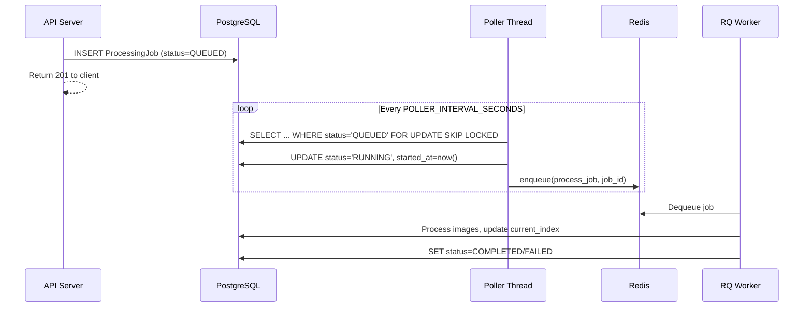

# Redis Queue Plan

## Overview

### Problem

The job system uses an in-process queue via FastAPI `BackgroundTasks`. The function `start_job_if_none_running()` starts a background task, and `process_job_and_check_queue()` recursively picks up the next QUEUED job after each completion. This couples the worker to the API server: they cannot scale independently, queue state is lost on crash, and only a single worker can process jobs.

### Purpose

Replace the in-process queue with RQ (Redis Queue) using the outbox pattern. The API server writes jobs to the database only. A poller thread discovers QUEUED jobs and enqueues them to RQ. Separate worker containers pick up jobs from RQ and process them with a resident SAM3 model. This decouples the API from job execution, enabling horizontal scaling of GPU workers.

### Scope

**IN scope:**

- Add Redis to docker-compose infrastructure
- Add RQ as job queue between poller and worker
- Outbox pattern: API writes to DB only, poller enqueues to RQ
- Worker as separate Docker container with GPU access
- Poller runs as thread inside worker container
- Worker updates DB directly for job status/progress
- SAM3 model loaded once per worker (kept resident)
- RQ built-in retry on worker crash (`Retry`)
- `SELECT FOR UPDATE SKIP LOCKED` to prevent double-enqueuing across multiple pollers
- Configurable poller interval, stale job threshold, and failure threshold
- Stale job cleanup integrated into poller loop
- Remove in-process queue code (`start_job_if_none_running`, `process_job_and_check_queue`, `cleanup_stale_jobs` from API lifespan)

**OUT of scope:**

- Application-level job retry UI (re-run failed jobs from frontend)
- Job cancellation
- Job priority or routing
- Azure deployment configuration
- Multi-GPU worker testing
- Frontend changes (frontend already polls job status via API)

### Success Criteria

- Jobs created via API are picked up by workers within the poller interval
- Multiple workers can run concurrently without double-processing jobs
- Worker crash triggers RQ retry and stale job recovery
- Existing tests pass (API route tests, snapshot tests, mode processor tests)
- New tests cover poller logic and worker task function

## Solution Design

### System Architecture

**Core Components:**

- **API server** — Creates `ProcessingJob` in DB with status=QUEUED. Has no Redis dependency. The `create_job` route no longer calls `start_job_if_none_running()`.
- **Poller thread** (runs inside worker container) — Polls DB for QUEUED jobs using `SELECT FOR UPDATE SKIP LOCKED`, enqueues job_id to RQ, sets status=RUNNING. Also handles stale job cleanup.
- **RQ worker** (runs inside worker container) — Picks up jobs from RQ, processes images with resident SAM3 model, updates DB progress and status.
- **Redis** — Message broker between poller and RQ worker.

**Component Interaction:**



**Poller Cleanup Logic:**

Each poll cycle executes three steps in order:

1. **Fail expired jobs:** QUEUED or RUNNING jobs with `created_at` older than `FAILED_JOB_TIMEOUT_SECONDS` are set to FAILED (something is fundamentally wrong — Redis down, no workers alive, or job stuck indefinitely).
2. **Reset stale jobs:** RUNNING jobs with `started_at` older than `STALE_JOB_TIMEOUT_SECONDS` are reset to QUEUED (worker likely crashed; gives the job another chance via re-enqueue).
3. **Enqueue new jobs:** QUEUED jobs are locked with SKIP LOCKED, set to RUNNING, and enqueued to RQ.

**Project Structure:**

```
packages/samui-backend/
├── src/samui_backend/
│   ├── config.py [MODIFY]              -- Add Redis URL and poller/timeout settings
│   ├── main.py [MODIFY]                -- Remove cleanup_stale_jobs from lifespan
│   ├── worker.py [CREATE]              -- Worker entry point: loads SAM3, starts poller thread, runs RQ worker
│   ├── poller.py [CREATE]              -- Poller loop: cleanup stale jobs, enqueue QUEUED jobs to RQ
│   ├── routes/
│   │   └── jobs.py [MODIFY]            -- Remove start_job_if_none_running call and BackgroundTasks param
│   └── services/
│       ├── __init__.py [MODIFY]        -- Remove start_job_if_none_running, process_job_and_check_queue, cleanup_stale_jobs exports
│       └── job_processor.py [MODIFY]   -- Remove start_job_if_none_running, process_job_and_check_queue, cleanup_stale_jobs; remove BackgroundTasks usage; keep process_job and process_single_image
├── pyproject.toml [MODIFY]             -- Add rq and redis dependencies
docker-compose.yaml [MODIFY]            -- Add redis and worker services
.env.example [MODIFY]                   -- Add REDIS_URL and poller config vars
```

**Relationship to Existing Codebase:**

- `process_job()` in `job_processor.py` is reused as the RQ task function with minor changes: it no longer sets status=RUNNING (poller already did), and it no longer calls `sam3.load_model()`/`unload_model()` (model is resident in worker).
- `process_single_image()` and mode processors (`process_inside_box`, `process_find_all`, `process_point`) are unchanged.
- `get_background_db()` is reused by the worker for DB access.
- `dependencies.py` singletons (`get_sam3_service`, `get_storage_service`) are reused by the worker.
- Frontend is unchanged — it already polls `GET /jobs/{job_id}` for status.

### Design Rationale

**Outbox pattern over direct enqueue from API**

The API only writes to PostgreSQL. A poller thread reads QUEUED jobs and enqueues to RQ. This avoids the dual-write problem: if the API wrote to both DB and Redis, a failure in either would leave inconsistent state. With the outbox pattern, the DB is the single source of truth, and the poller provides at-least-once delivery to RQ.

**Poller as thread inside worker over separate container**

Running the poller inside each worker container is simpler operationally than deploying a dedicated poller container. Multiple poller instances (one per worker) safely compete using `SELECT FOR UPDATE SKIP LOCKED`. This avoids a single point of failure and scales naturally with workers.

**No new job status (ENQUEUED)**

`SKIP LOCKED` prevents double-enqueuing. The stale job cleanup handles the edge case where the poller crashes between setting RUNNING and enqueuing to RQ (job stuck as RUNNING, reset to QUEUED on next poll). Adding an ENQUEUED status would add complexity without solving a real problem.

**RQ over Celery/ARQ**

RQ has the simplest API of Python task queues. It's Redis-backed, well-maintained, and sufficient for this use case. Celery adds broker configuration complexity and features not needed here. ARQ is async-native but has a smaller community and less mature tooling.

**SAM3 model resident per worker over per-job load/unload**

Currently `process_job()` calls `sam3.load_model()` at the start and `sam3.unload_model()` at the end. With dedicated GPU workers, the model should load once at startup and stay resident. This eliminates the per-job model loading overhead (significant for large models). Each worker = one GPU with one loaded model.

**Configurable timeouts with dev/prod profiles**

The poller interval, stale threshold, and failure threshold have sensible defaults for development (short timeouts for fast iteration) and can be overridden via environment variables for production (longer timeouts for large jobs). This is implemented via `pydantic-settings` in `config.py`, consistent with existing configuration patterns.

### Technical Specification

**Dependencies:**

New libraries:
- `rq>=1.16` — Redis Queue task framework
- `redis>=5.0` — Redis client (RQ dependency, but explicit for connection management)

New infrastructure:
- Redis container in docker-compose

Existing (unchanged):
- PostgreSQL, Azure Blob Storage (Azurite), FastAPI, SQLAlchemy, PyTorch

**Runtime Behavior:**

Worker startup:
1. Load SAM3 model (kept resident for worker lifetime)
2. Start poller thread (daemon thread)
3. Start RQ worker loop (blocks on Redis queue)

Poller loop (each cycle):
1. Fail expired jobs: `UPDATE processing_jobs SET status='failed' WHERE status IN ('queued', 'running') AND created_at < now() - FAILED_JOB_TIMEOUT`
2. Reset stale jobs: `UPDATE processing_jobs SET status='queued' WHERE status='running' AND started_at < now() - STALE_JOB_TIMEOUT`
3. Enqueue new jobs: `SELECT ... FROM processing_jobs WHERE status='queued' FOR UPDATE SKIP LOCKED` → set RUNNING → enqueue to RQ
4. Sleep `POLLER_INTERVAL_SECONDS`

RQ task (`process_job`):
1. Fetch job from DB (already RUNNING, set by poller)
2. Iterate through `image_ids`, update `current_index` per image
3. Call `process_single_image()` for each image (unchanged logic)
4. Set status=COMPLETED or FAILED
5. On worker crash: RQ retries via `Retry(max=3)`

**Configuration:**

| Variable | Default (dev) | Production example | Description |
|---|---|---|---|
| `REDIS_URL` | `redis://localhost:6379` | `redis://redis:6379` | Redis connection URL |
| `POLLER_INTERVAL_SECONDS` | `5` | `30` | How often poller checks for new jobs |
| `STALE_JOB_TIMEOUT_SECONDS` | `60` | `600` | Time before RUNNING job is considered stale |
| `FAILED_JOB_TIMEOUT_SECONDS` | `120` | `3600` | Time before QUEUED/RUNNING job is marked FAILED |

**Error Handling:**

- Redis unavailable at worker startup: worker fails to start (fail fast)
- Redis unavailable during polling: poller logs error, retries next cycle (jobs stay QUEUED in DB, no data loss)
- DB unavailable during polling: poller logs error, retries next cycle
- Worker crash mid-job: RQ retries (up to 3 attempts), stale cleanup resets to QUEUED if retries exhausted

## Implementation Strategy

### Development Approach

**Incremental, bottom-up with safe checkpoints**

Build infrastructure first, then the new components, then rewire the existing code:

1. **Infrastructure** — Add Redis to docker-compose, add dependencies, add configuration. Verifiable by starting services.
2. **New components** — Create poller and worker modules. These are new code that can be tested independently.
3. **Integration** — Rewire the API route and job processor to remove in-process queue. Clean up dead code. Update tests.

Each phase produces a working, testable state. The API continues to function between phases (existing in-process queue works until phase 3 replaces it).

### Testing Approach

- Unit test the poller logic (stale cleanup, SKIP LOCKED enqueue) with a test DB
- Unit test the worker task function with mocked SAM3 and storage
- Update existing API route tests to remove `start_job_if_none_running` mock (no longer called)
- Existing snapshot, mode processor, and export tests should pass unchanged

### Checkpoint Strategy

Each phase ends with:
- **Self-review:** Agent reviews implementation against phase deliverable
- **Code quality:** `uvx ruff check packages/samui-backend/src/ && uvx ruff format --check packages/samui-backend/src/`
- **Dead code:** `uvx vulture packages/samui-backend/src/ --min-confidence 80` (verify removed functions don't leave orphans)
